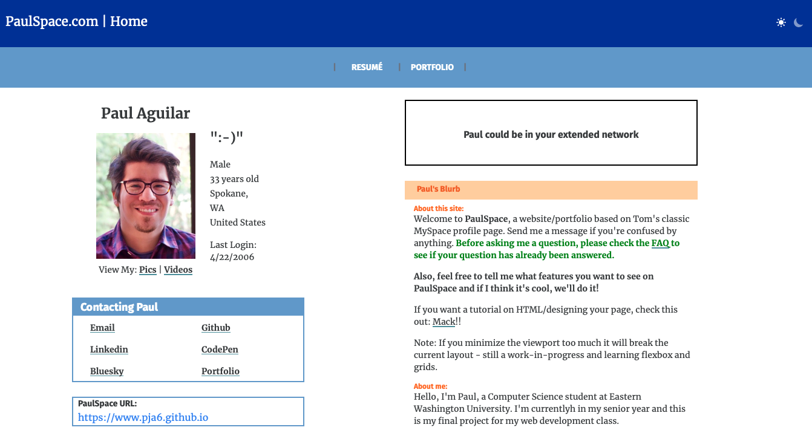

# My Personal Website 

## This is my final project for my web development class CSCD378

### Its design is an attempt to recreate the classic MySpace page using Astro and Tailwind

#### It uses an Astro blog template created by [Maxi Ferreira](https://astro-blog-template.netlify.app/)

        npm init astro -- --template Charca/astro-blog-template

#### As well as some styling elements from a recreation of Tom's original MySpace page by [William Wittenbrock](https://wittenbrock.github.io/toms-myspace-page/)

